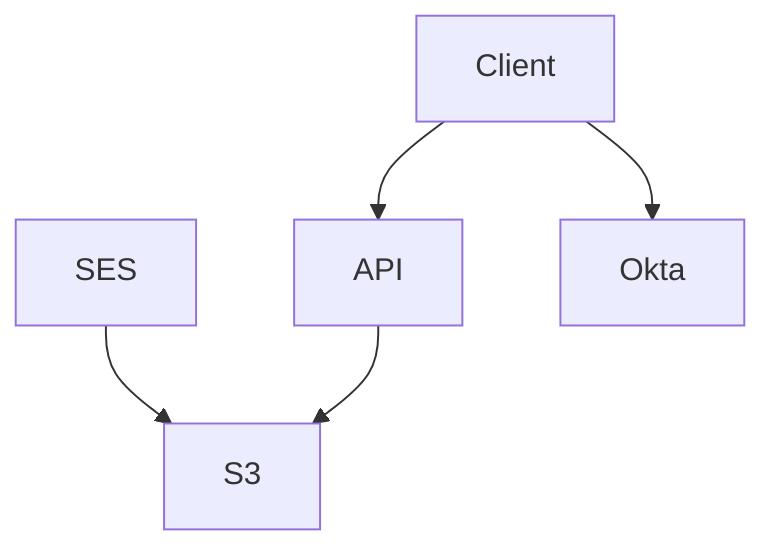

# atko.email

Demonstration emails done right. An dynamic mailbox service for Solution Engineers or anyone who needs a temporary email.


## Architecture

Atko.email relies on AWS SES and Okta to be established before deploying the serverless package.



## Setup

### Okta Tenant

Atko.email uses a custom authorization server in Okta. A custom claim of ```maildomains``` is expected by the API on the user's access token this must contain a list of the domains to which a user has access. This should be a list of the user's groups where the groupname has the format ```mailbox:example.com```.

### API

The API component can be deployed via Serverless by executing ```sls deploy``` from the atkomail-api directory. A number of parameters are required to be deployed to your serverless app configuration for the API to perform correctly.

```
aws-account-id - The AWS account that the service will be deployed in
bucket-name - The S3 bucket to which mail is sorted
origins - Allow list for CORS
audience - The expected audience for user access tokens
issuer-uri - The issuer of user access tokens
event-service-clientid - The client id for the event service
event-service-secretname - The name of the secret in AWS SSM holding the event service private key
fixed-secret - The secret sent by Okta to authenticate incoming events
mix-panel-token - The token to send event data to MixPanel
```

### AWS SES

SES must be manually configured. SES will invoke lambdas deployed in the API when mail events occur. On recieving mail bound for Atko.email SES should invoke ```mailroom/s3.sort```.

### Client

The client is provided as a SPA to be deployed via your choice of hosting, it requires the following .env file to be created to configure.

```
REACT_APP_CLIENT_ID = <clientid>
REACT_APP_ISSUER = <issuer URI>
REACT_APP_API_ENDPOINT = https://api.atko.email
```